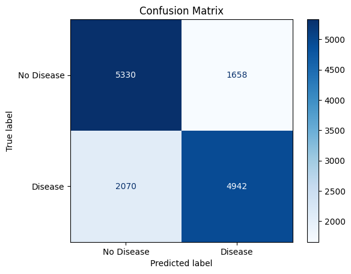

# Cardiovascular Disease Prediction using Neural Networks

This repository contains a Flask web application that allows users to predict the likelihood of cardiovascular disease using a trained neural network model. The model is built using PyTorch and trained on the UCI Cardiovascular Disease dataset.

## Features

- **Model**: A multi-layer fully connected neural network implemented in PyTorch.
- **Web Interface**: Built using Flask to provide a simple and intuitive way to input data and get predictions.
- **Real-Time Notifications**: Displays color-coded messages based on the prediction results.
- **Graphs and Metrics**: Evaluate the model using various performance metrics like accuracy, precision, F1-score, and visualizations like confusion matrix.

## Dataset

The model was trained on the UCI Cardiovascular Disease dataset, downloaded via [KaggleHub](https://www.kaggle.com/sulianova/cardiovascular-disease-dataset). The dataset contains over 70,000 records with features such as age, cholesterol levels, blood pressure, and more.

## Model Architecture

The neural network consists of the following layers:

1. Fully Connected: 16 input features to 64 units
2. Fully Connected: 64 units to 128 units
3. Fully Connected: 128 units to 256 units
4. Fully Connected: 256 units to 512 units
5. Fully Connected: 512 units to 256 units
6. Fully Connected: 256 units to 128 units
7. Fully Connected: 128 units to 64 units
8. Fully Connected: 64 units to 1 unit (output)

Activation Function: ReLU

## Installation

### Prerequisites

- Python 3.8+
- PyTorch
- Flask
- scikit-learn
- matplotlib

### Steps

1. Clone the repository:
   ```bash
   git clone https://github.com/your-username/heart-disease-detection.git
   cd heart-disease-detection
   ```

2. Install dependencies:
   ```bash
   pip install -r requirements.txt
   ```

3. Run the Flask application:
   ```bash
   python server.py
   ```

4. Open your browser and navigate to `http://127.0.0.1:5000` to use the app.

## Usage

1. Input patient data such as age, cholesterol levels, blood pressure, etc.
2. Click on the **Evaluate** button.
3. View the prediction result along with a color-coded notification (e.g., red for high risk, green for low risk).

## Visualizations

The notebook included in this repository provides various visualizations for the dataset and model performance:

- Confusion Matrix

## Model Metrics

- **Accuracy**: 73.37%
- **Precision**: 74.88%
- **F1-score**: 72.61%

## Confusion Matrix

The confusion matrix for the model's predictions is shown below:




## File Structure

```
.
├── model.py                     # Contains the functions to load the model
├── server.py                    # Flask application
├── models/model.pth             # Trained PyTorch model
├── requirements.txt             # Dependencies
├── scaler/scaler.pkl            # The StandardScaler used while training the model
├── templates/                   # HTML templates
├── dataset/cardio_train.csv     # Cardiovascular dataset
├── notebooks/main.ipynb         # Jupyter Notebook for analysis and model training
├── images/confusion_matrix.png  # The confusion matrix of the model
└── README.md                    # Project documentation
```

## Contributing

Contributions are welcome! Please open an issue or submit a pull request for any improvements or suggestions.

## License

This project is licensed under the MIT License. See the `LICENSE` file for details.

## Acknowledgments

- Dataset: [UCI Cardiovascular Disease Dataset](https://www.kaggle.com/sulianova/cardiovascular-disease-dataset)
- Libraries: PyTorch, Flask, scikit-learn, matplotlib

## Credits

Developed by [A.Jagan Karthick](https://github.com/JAGAN-KARTHICK-A).